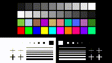
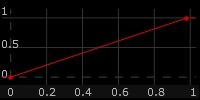
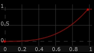
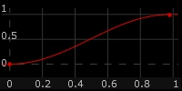
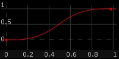
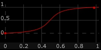
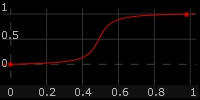

# Sourcerer

#### TouchDesigner version 2019.20140

License: MIT

[Matthew Wachter](https://www.matthewwachter.com)

[VT Pro Design](https://www.vtprodesign.com)

## Introduction

Sourcerer is a media organization solution that provides an efficient and flexible system for the playback, processing, and switching of image files and generative sources from within a TouchDesigner scene.


## Description
In a typical show file, there may be a large number of sources that need to be displayed. Without the help of any organizational tools, a programmer might find themselves lost in a "Sourcerer's Apprentice" type disaster of nodes and wires plugged into one absolute unit of a Switch TOP. This can leave the wizard feeling overwhelmed with the complexity of their scene and when a simple change needs to be made to a particular source, they might have a difficult time finding that magical elusive operator that needs a slight tweak.

Apart from the many parameters that an image file or a generative source within the scene might have, a few post-processing effects might need to be applied to a source such as:

- Crop
- Tile
- Flip
- Brightness
- Gamma
- Contrast
- Color 
- H/S/V
- Translation
- Scale
- Rotation	

As well, one might need to deal with some playback logic like:
	
- How long should a source play or loop?
- What should be played next?
- What type of transition is needed?
- How long is the transition?
- Do a script need to be run?

If there are a great number of sources in a scene that require effects or logic, things can quickly become quite taxing on the system. Often times, the programmer will find themselves in a position where they've run out of the physical resources needed to achieve their desired framerate.

Sourcerer aims to consolidate all of the above mentioned into a list of "sources" (presets) that can be created and recalled via 2 interfaces: the UI buttons, and the promoted extension methods. 

## How to Use

Sources can be created, arranged, and triggered by using the buttons above the list of sources. New sources may also be created by dropping files or TOPs directly into the source list or by using the import/export buttons found in Sourcerer's **Settings** parameter page.

The selected source's parameters are editable in the _top right_ section of the interface (**Selected**) and the currently playing (**Live**) source is editable in the _bottom right_ section. Once changes have been made to a **Live** source, the user can click the **Save To Selected Source** button to write the parameter values back to the selected source if desired.

### Buttons

The buttons at the top of the source list are as follows:

-  Add a new source,
-  Copy a Source,
-  Delete a source,
-  Move a source up in the list
-  Move a source down in the list
-  Switch to the selected source
-  Enable/Disable the editing interface to save system resources.

### Promoted Extension Method

The user may also choose to use the promoted extension method SwitchToSource(source) where the "source" variable can either be an integer value to switch to a source by index or a string value to switch to a source by name.

Examples:
	
- Switch to a source by index (int):

	```
	op('Sourcerer').SwitchToSource(1)
	```

- Switch to a source by name (str):
	
	```
	op('Sourcerer').SwitchToSource('Blackout')
	```

### Transitions

Inside the Sourcerer component you will find a transition component that uses a single GLSL TOP to handle all transition modes. The pixel shader for this top can be found in the **scripts** folder (scripts/transitions.glsl).

These transitions were ported from these two locations:

	- [Jeffers](https://forum.derivative.ca/t/transition-component/1859)
	- [gl-transitions](https://gl-transitions.com/)

The transition **into** each source may be defined under the settings parameter page for each source.

Transition time is set in seconds via the **Transition Time** parameter. Alternatively, if the **Use Global Transition Time** parameter is **True** then this time can be set using the **Global Transition Time** parameter found in Sourcerer's Settings parameter page.

There are 3 primary types of transitions: **GLSL**, **File**, and **TOP**.

- **GLSL** - Pick from a list of 24 premade transitions. Many of the GLSL transitions have parameters that can be found in each source's **GLSL Transition** parameter page.

	- **Additive**
		- 
	- **Average**
		- 
	- **Blinds**
		- 
	- **Blood**
		- 
	- **Circle Reveal**
		- 
	- **Circle Stretch**
		- 
	- **Cloud Reveal**
		- 
	- **Color Burn**
		- 
	- **Color Distance**
		- 
	- **Cross Warp**
		- 
	- **Cube Left**
		- 
	- **Cube Right**
		- 
	- **Difference**
		- 
	- **Dissolve**
		- 
	- **Dreamy**
		- 
	- **Fade**
		- 
	- **Fade Black**
		- 
	- **Linear Blur**
		- 
	- **Maximum**
		- 
	- **Morph 1**
		- 
	- **Morph 2**
		- 
	- **Perlin**
		- 
	- **Radial Blur**
		- 
	- **Random Squares**
		- 
	- **Ripple**
		- 
	- **Stretch**
		- 
	- **Swap Left**
		- 
	- **Swap Right**
		- 


- **File** - Specify a file on the disk.
	- Should start in black and end in white.
	- The file is played over the duration of the transition set with the **Transition Time** parameter.
	- Frames are automatically interpolated.

- **TOP** - Specify a TOP in the scene.
	- Should start in black and end in white.
	- **transition_progress** and **transition_value** can be used to drive a TOP transition. **transition_progress** is the transition's linear index (0 to 1) and **transition_value** is the lookup value across the **Transition Shape**.

The **Transition Progress Shape** parameter sets the filter shape (or slope shape) of the transition's progress. This parameter can affect the feeling of the transition by rounding out the start and/or end of the transition's speed.

There are several types of shapes to choose from:

- **Linear**
	- A constant linear slope that can feel a bit mechanical. Usually this is desired for a custom transition file as the frames play back at a constant rate.
	- 

- **Ease In**
	- A Logistic curve with a bias of -.2.
	- 

- **Ease Out**
	- A Logistic curve with a bias of .2.
	- 

- **Half Cosine (soft)**
	- Steepness: 1
	- 

- **Half Cosine (hard)**
	- Steepness: 1.25
	- 

- **Logistic (soft)** - Steepness: .5
	- 

- **Logistic (hard)**
	- Steepness: 1
	- 

- **Arctangent (soft)**
	- Steepness: .5
	- 

- **Arctangent (hard)**
	- Steepness: 1
	- 

- **Custom**
	- Provide the path to a CHOP in the **Custom Transition Shape** parameter.
	- This CHOP should have a single channel with many samples that **start at 0** and **end at 1**.
	- Ideally the number of samples is a function of the desired transition time multiplied by the frame rate of the scene but this is not required as the samples will be automatically interpolated.
	- The **S Curve CHOP** is the ideal operator to create this with.


### Follow Actions

Each source is provided a **Follow Action** parameter that defines what happens when the source is done playing. Sourcerer can automatically play the next source or go to another source by index or name. For those of you familiar with Ableton, this can be thought of as _clip follow actions_.

The **Done On** parameter defines when to execute the **Follow Action**. The options available for this parameter choice depend on the selected **Source Type**.

- **File**
	- **Play (n) Times** - A number of times for the file to loop.
	- **Timer** - An amount of time to play for in seconds.
	- **CHOP** - A CHOP channel that toggles from 0 to 1.
	- **Done Pulse** - A pulse parameter (usually used only in testing).
- **TOP**
	- **Timer** - An amount of time to play for in seconds.
	- **CHOP** - A CHOP channel that toggles from 0 to 1.
	- **Done Pulse** - A pulse parameter (usually used only in testing).

Once the **Done On** requirement has been met, the specified **Follow Action** will be executed.

### Callbacks

Callbacks are made to the callbacks script located at the root level of the Sourcerer. This script can be edited by using the **Open Callbacks Script** button in the component's **Settings** parameter page. There are several callbacks available in the callbacks script:

- **onSourceDone(index, name, source)** - Called when a source has signaled that it is done.
	- **index** - The index of the source.
	- **name** - The name of the source.
	- **source** - A JSON dictionary that contains all of the source's parameters and their respective attributes.

- **onSwitchToSource(index, name, source)** - Called when a source is switched.
	- **index** - The index of the source.
	- **name** - The name of the source.
	- **source** - A JSON dictionary that contains all of the source's parameters and their respective attributes.

- **onTransitionComplete(index, name, source)** - Called when the transition to a new source has completed.
	- **index** - The index of the source.
	- **name** - The name of the source.
	- **source** - A JSON dictionary that contains all of the source's parameters and their respective attributes.

## Configuration

### Sourcerer Parameters

#### Settings

- **Version** (read only) - The version of this component.

- **Resolution** - The resolution of the background that the sources are composited over.

- **BG Color** - The color of the background that the sources are composited over.

- **Global Transition Time** - A global transition time setting that each source has access to.

- **Import** - Import a JSON file of sources. A prompt will appear to replace all or append/prepend/insert new.

- **Export All** - Export all sources as a JSON file.

- **Export Selected** - Export the selected source as a JSON file.

- **Export Range** - Export the range of sources defined in the following parameter.

- **Range** - The range of sources to export using the **Export Range** pulse parameter.

- **Edit Callbacks Script** - Opens the callbacks script.


### Source Parameters

#### Settings

- **Name** - The name that is displayed in the list of sources. This is callable via the **SwitchToSource()** method outlined above.

- **Source Type** - Either File (location on disk) or TOP (path of a top in your scene). This selection enables/disables the two following parameter pages.

- **Transition Type** - The type of transition to use when switching to _THIS_ source.

- **GLSL Transition** - The GLSL transition type to use.

- **Transition File** - A file on the disk that starts in black and ends in white.

- **Transition TOP** - A user provided TOP that starts in black and ends in white. The **transition_progress** channel of the Sourcerer's CHOP output can be used to drive this transition.

- **Use Global Transition Time** - Uses the global transition time instead of the following parameter.

- **Transition Time** - The length of the transition when switching to _THIS_ source.

- **Transition Progress Shape** - The slope shape of the transition progress.

- **Custom Transition Shape** - A user provided CHOP with a single channel that starts at 0 and ends at 1.

- **Enable Command** - Enable the command in the Command parameter to be executed when _THIS_ source is switched to.

- **Command** - The python command to execute when _THIS_ source is switched to if the Enable Command parameter is True.

- **Command Pulse** - A test button to fire off the command.

#### GLSL Transition

- **Blinds Num** - The number of "blinds" or divisions for the **Blinds** transition.

- **Blood Seed** - The random seed for the **Blood** transition.

- **Circle Reveal Fuzzy** - The edge blend amount for the **Circle Reveal** transition.

- **Color Burn Color** - The color of the **Color Burn** transition.

- **Color Distance Power** - The power of the **Color Distance** transition.

- **Dissolve Seed** - The random seed for the **Dissolve** transition.

- **Linear Blur Intensity** - The amount of blur that will be applied to the **Linear Blur** transition.

- **Linear Blur Passes** - The number of blur iterations for the **Linear Blur** transition.

- **Maximum Distance** - The distance from the maximum pixel value in which each pixel is transitioned for the **Maximum** transition.

- **Maximum Fade-in Distance** - The pixel fade-in distance for the **Maximum** transition.

- **Morph 1 Strength** - The strength of the morph function for the **Morph1** transition.

- **Perlin Scale** - The size of the perlin noise for the **Perlin** transition.

- **Perlin Seed** - The random seed for the **Perlin** transition.

- **Perlin Smoothness** - The fade on the edge of the noise for the **Perlin** transition.

- **Pixelize Squares Min** - The minimum size of the squares for the **Pixelize** transition.

- **Pixelize Steps** - The number of steps to take in the **Pixelize** transition.

- **Radial Blur Center** - The epicenter of the **Radial Blur** transition. 

- **Random Squares Size** - The size of each square for the **Random Squares** transition.

- **Random Squares Smoothness** - The fade on the edge of the squares for the **Random Squares** transition.

- **Ripple Amplitude** - The intensity of the ripples for the **Ripple** transition.

- **Ripple Center** - The epicenter of the ripples for the **Ripple** transition.

- **Ripple Frequency** - The number of ripples for the **Ripple** transition.

- **Ripple Speed** - The speed of the ripples for the **Ripple** transition.


#### File

- **File** - The path of the file.

- **File Length Frames** (read only) - The length of the file in frames.

- **Trim** - Enable file trimming.

- **Trim Start Frames** - The frame to start the file on.

- **Trim End Frames** - The frame to end the file on.

- **Speed** - File playback speed multiplier (1=100%).

- **Interpolate frames** - Blend between frames when playing slower than 100%.

- **Cue** - A toggle switch to cue the video at the Cue Point Frames parameter.

- **Cue Pulse** - A pulse to cue the video at the Cue Point Frames parameter.

- **Cue Point Frames** - The point in the video (in frames) to cue from.

- **Loop Crossfade Frames** - The number of frames to crossfade a loop.

- **Deinterlace** - Deinterlace the playback (Even/Odd/Bob(split)).

- **Field Precedence** - Deinterlace mode (Even/Odd).

- **Extend Right** - Define what happens at the end of the file.

- **Done On** - When to evaluate the Follow Action (None, Play (n) Times, Timer, CHOP Channel).

- **Play (n) Times** - Number of times to play the file before the Follow Action is triggered.

- **Timer Time (sec)** - Amount of time to play the file before the Follow Action is triggered.

- **CHOP** - Path to a CHOP who's first channel triggers the Follow Action when toggled from off (0) to on (1).

- **Done Pulse** - Trigger the Follow Action immediately.

- **Follow Action** - The type of Follow Action to use (None, Play Next, Go to Index, Go to Name).

- **Go To Index** - The index (int) of the next source to play.

- **Go To Name** - The name (str) of the next source to play.


#### TOP

- **TOP** - The path to the TOP to be displayed.

- **Enable Cue Top** - Enable this parameter to allow the Moviefilein TOP in the following parameter to be cued when <u>THIS</u> source is switched to.

- **Cue TOP** - The path to the Moviefilein TOP to pulse the cue parameter on.

- **Cue TOP Pulse** - Send a cue pulse to the operator defined in the Cue TOP Parameter.

- **Done On** - When to evaluate the Follow Action (None, Timer, CHOP Channel).

- **Timer Time (sec)** - Amount of time to play the file before the Follow Action is triggered.

- **CHOP** - Path to a CHOP who's first channel can trigger the Follow Action when toggled from off (0) to on (1).

- **Done Pulse** - Trigger the Follow Action immediately.

- **Follow Action** - The type of follow action to use (None, Play Next, Go to Index, Go to Name).

- **Go To Index** - The index (int) of the next source to play.

- **Go To Name** - The name (str) of the next source to play.


#### Crop / Tile

- **Crop Left** - 0 to 1 fraction of where to crop the left side of the image.

- **Crop Right** - 0 to 1 fraction of where to crop the right side of the image.

- **Crop Bottom** - 0 to 1 fraction of where to crop the bottom of the image.

- **Crop Top** - 0 to 1 fraction of where to crop to top of the image.

- **Crop Extend** - Defines what to do with the image when the crop value exceeds the 0 to 1 space.

- **Transpose** - Swap the x and y coordinate space of the image.

- **Flip X** - Flip the x coordinate space of the image.

- **Flip Y** - Flip the y coordinate space of the image.

- **Repeat X** - Number of times to repeat the image in x.

- **Repeat Y** - Number of times to repeat the image in y.

- **Reflect X** - Reflect the image in x if repeated.

- **Reflect Y** - Reflect the image in y if repeated.

- **Overlap U** - Overlap the image in u to create a soft edge.

- **Overlap V** - Overlap the image in v to create a soft edge.


#### Color

- **Invert** - Inverts the colors in the image. Black becomes white, white becomes black.

- **Black Level** - Any pixel with a value less than or equal to this will be black.  

- **Brightness** - Increases or decreases the brightness of an image. Brightness can be considered the arithmetic mean of the RGB channels. The Brightness parameter adds or subtracts an offset into the R, G, and B channels.

- **Gamma** - The Gamma parameter applies a gamma correction to the image. Gamma is the relationship between the brightness of a pixel as it appears on the screen, and the numerical value of that pixel.

- **Contrast** - Contrast applies a scale factor (gain) to the RGB channels. Increasing contrast will brighten the light areas and darken the dark areas of the image, making the difference between the light and dark areas of the image stronger.

- **Red** - Clamps the maximum level of the red channel.

- **Green** - Clamps the maximum level of the green channel.

- **Blue** - Clamps the maximum level of the blue channel.

- **Hue** - Shifts the hue of the image.

- **Saturation** - Adjusts the saturation of the image.

- **Value** - Adjusts the overall color value of the image.


#### Transform

- **Pre-Fit Overlay** - Defines how the image is placed over the component's resolution (Fill, Fit Horizontal, Fit Vertical, Fit Best, Fit Outside, Native Resolution).

- **Justify Horizontal** - Where to justify the image horizontally (Left, Center, Right).

- **Justify Vertical** - Where to justify the image vertically (Bottom, Center, Top).

- **Extend Overlay** - What to do with the negative space around the image if it exists.

- **Translate** - Translates the image in x and y (0 to 1 space).

- **Scale** - Scales the image in x and y (0 to 1 space).

- **Rotate** - Rotates the image.